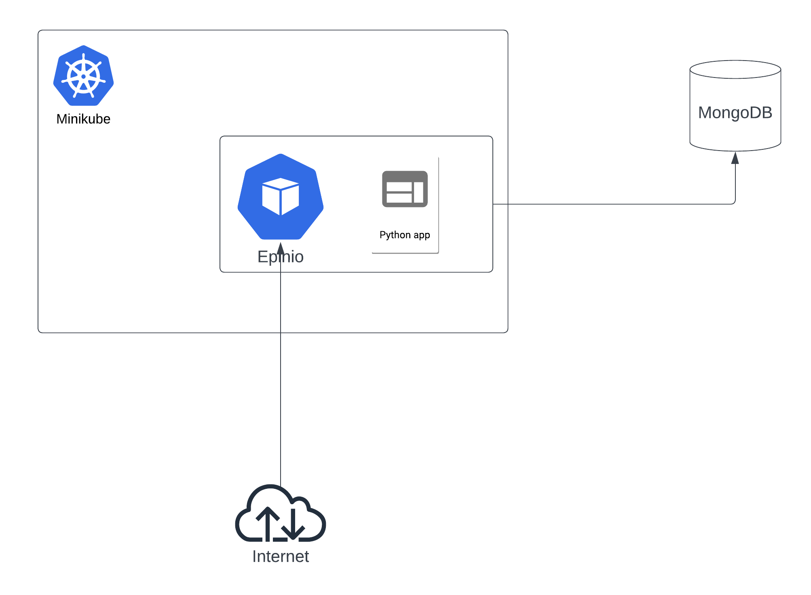

# This is the repository for JP Morgan Chase SRE area @ Ilia

* This repo is intended to show how to deploy a simple application using Minikube + Epinio (which is the main focus of everything here)

* The Python application used here is a simple FastAPI application which will call the Database and confirm if the connection was successful. Since there is no requirements on what to do with the database part, and considering this is only for demo purpose, this should be enough.

* The database is a MongoDB one, hosted in MongoAtlas.

## How it works

* To deploy it, you only have the following requirements:

* Minikube (over 1.30.x) - I opted to not install it by a script, because I had some weird problems with the Hyperkit and the Docker driver. But considering its just a matter to run a **minikube start**, that should be fine.
* Python 3.9, with all the libs in requirements.txt installed
* cert-manager, ingress controller (nginx prefered), and epinio charts
* A MongoDB database deployed (up to you if it's a local Docker container or something at Atlas.)

To run it, install minikube from here: https://minikube.sigs.k8s.io/docs/start/, and then

* Run the script in **minikube-stuff/main.sh**

This script will install all the required extensions and create the certificate in Minikube to make the basic run. 

It also uses sslip.io to emulate a valid domain in your local machine (required for the self signed SSL cert)

Then, run:

* **minikube-stuff/install_epinio_cli.sh**

That will install all the required Epinio CLIs (for Linux systems, in this case).

## Finally running the Epinio to push the new application:

Using the Wordpress tutorial as a example, you can push a application to epinio easy as running the following command:

* epinio push --name |application| 

this is the bare minimum to run a application inside Epinio. And after it goes up, you should be able to reach it by http://localhost.

 
## Some explanations about the demo MongoDB application:

* The Python application is just a demo application which tests the database connection to a remote MongoDB, after logging into the server. It is currently logged into a MongoAtlas server.

* To allow the compliance to some best practices, the password is not hardcoded in the code, but it uses a .env file for the staging, which is our case (and production should use at least a centralized key/secret storage at minimum)

* This is not required, but this application is Docker ready, and you can create a container for it any time you want.

## Architechture overview

